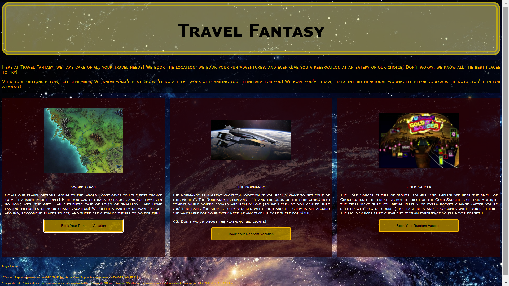

#Day Trip Project

##My First Finished Project
This project demonstrates the ability to select variables randomly and to be able to reassign those variables.  It also demonstrates the ability to write and utilize functions, to use objects, and to assign and manipulate variables.  

Flair was added to the project to challenge myself to work with and on a theme, including designing a mock page for a shady, fantastical travel agency.  While HTML and CSS have not been covered in courses yet, I'm just as interested in making things look good as I am in making them work.  

I did not edit this readme as I went along with my commits, because I didn't know I could do it right in VS!  Going forward, I will try to utilize the readme as well as my other tools. 

For my final commit, though, I fixed a couple small things in the CSS, some grammatical/typing errors, made it easier to evaluate what was being logged to the console, and edited this file (and hopefully correctly added the image to the top of it).